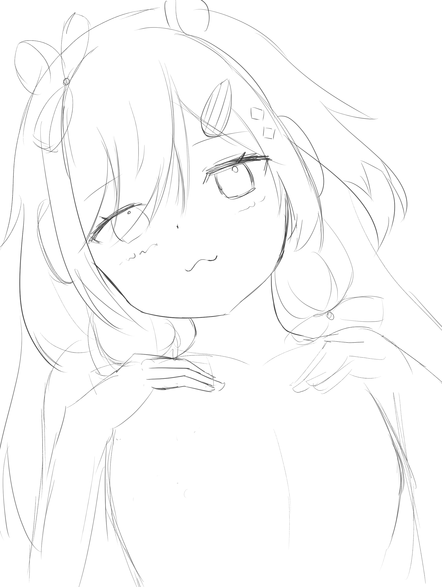

# suzuri-lollipop-illust-history

このリポジトリはクリエイター「鈴莉」によるイラスト集です。

この作品のライセンスは[CC BY-NC-SA 4.0](https://creativecommons.org/licenses/by-nc-nd/4.0/?ref=chooser-v1)です。

## 私の作品のを利用するにあたって

このリポジトリにある作品を利用する際には、以下の点を厳守してください。

- クレジットの表示 (名前、作品タイトルなど)
- 非営利目的であること

また、

- 私のイラストの複製
- 私のイラストの再配布
- 私のイラストの加工(トリミング・色補正・加筆など)を施したデータの公開
- 私のイラストを使用したトレーニング済みAIモデルの公開
- 私のイラストを用いた学習済みAIモデルで出力したイラストの公開

などを行う際は必ず私のクレジット(氏名、作品タイトルなど)を表示し、かつ非営利目的に限り、また改変を行った際には元の作品と同じ組み合わせのCCライセンスで公開することを条件に使用してください。インターネットに接続しない環境で使用する(例えばＰＣやスマートフォンの壁紙)場合はこの限りではありません。

## 2025-01-12 タイトル： 「もっと私を視て」

